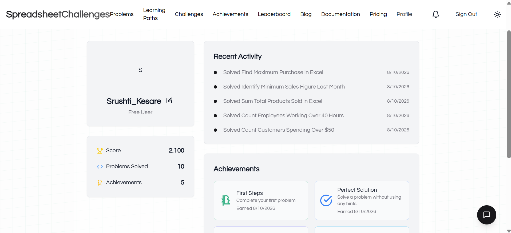

# 📊 Spreadsheet Challenges — Excel Practice

## 📌 Activity Overview

This activity documents my hands-on practice through spreadsheet challenges designed to strengthen practical Microsoft Excel skills and analytical problem-solving.

I completed a series of spreadsheet challenges and applied Excel concepts to solve practical data-related problems.

---

## 🎯 Activity Objective

The objective of this activity was to strengthen Excel proficiency through repeated hands-on problem solving rather than only theoretical learning.

The activity focused on:

- Applying Excel concepts to practical problems
- Improving formula and function usage
- Developing analytical thinking
- Strengthening spreadsheet problem-solving skills
- Working efficiently with structured data
- Building confidence through repeated practice

---

## 🏆 Progress & Achievements

- **Challenges Completed:** 10
- **Points Earned:** 2,100
- **Achievements:** 5

The progress and achievements are documented in the supporting screenshot.

---

## 🛠️ Skills Practiced

The challenges provided practical opportunities to apply and reinforce Excel concepts, functions, data manipulation techniques, and analytical problem-solving.

The activity complements my structured Excel projects by providing additional practice in solving individual spreadsheet problems.

---

## 💡 Key Learning Outcomes

Through this activity, I strengthened my ability to:

- Approach spreadsheet problems systematically
- Apply Excel concepts in practical situations
- Analyze structured information
- Identify appropriate spreadsheet-based solutions
- Improve speed and accuracy while working with Excel
- Develop analytical problem-solving habits

---

## 📂 Activity Files

- 🖼️ [Challenge Progress & Achievements](01_Spreadsheet_Challenge_Progress.png)

---

## 📈 Activity Outcome

Completing these challenges provided additional hands-on Excel practice and reinforced the importance of applying concepts through repeated problem solving.

This activity forms part of my ongoing Data Analytics skill development and complements my core Excel portfolio projects.

---

### 📌 Activity Category

**Data Analytics — Extra Activity**

**Focus Area:** Spreadsheet Practice & Excel Problem Solving
